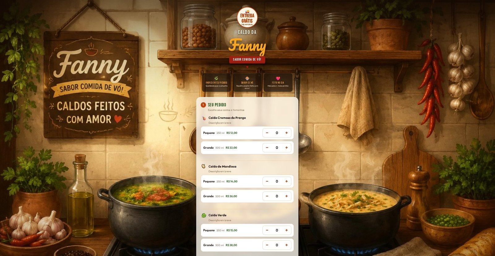

# 🍲 Caldo da Fanny

Site de pedidos para um delivery de caldos caseiros. O cliente monta o pedido pelo site —
escolhendo vários caldos em diferentes tamanhos — e finaliza pelo WhatsApp com a mensagem já
preenchida. Projeto desenvolvido de forma incremental, com testes e documentação de processo.

*Ordering website for a homemade soup-broth delivery business. Customers build an order on the
site — choosing multiple broths in different sizes — and finalize it via WhatsApp with a
pre-filled message. Built incrementally, with tests and process documentation.*

**🔗 Demo ao vivo / Live demo:** https://caldodafanny.netlify.app



---

## ✨ Visão geral / Overview

- **Frontend:** página única (`frontend/index.html`) — HTML, CSS e JS *vanilla*, sem framework
  nem build step. Mobile-first.
- **Cardápio e carrinho:** vários tipos de caldo, cada um em dois tamanhos (Pequeno/Grande) com
  **preço por item**; o cliente monta o carrinho, vê **subtotal e total** e passa por uma **tela
  de revisão** antes de confirmar.
- **Frete automático:** calculado no navegador por **distância em linha reta** (geocode via
  **Nominatim** + **Haversine**) até o endereço-base, com tabela em degraus e **fallback
  não-bloqueante** — se o geocode falhar, o frete fica "a confirmar pelo WhatsApp" e o pedido segue.
- **Backend:** Google Apps Script (`backend/google-apps-script.js`) que grava cada pedido numa
  planilha Google (`doPost`) — uma linha por pedido, com os itens, o endereço completo, o
  complemento e dois identificadores de pedido. Inclui validação e sanitização no servidor.
- **Integração:** WhatsApp via link `wa.me` com mensagem pré-montada.
- **Busca de endereço:** API pública ViaCEP (gratuita) para autopreencher o endereço a partir do CEP.
- **Testes:** suíte em Node + jsdom (`tests/`), cobrindo front e backend.
- **Hospedagem:** site estático no Netlify, com deploy automático a cada push.

---

## 🧱 Tech stack

`HTML` · `CSS` · `JavaScript (vanilla)` · `Google Apps Script` · `ViaCEP API` ·
`Nominatim (geocode)` · `Node + jsdom (tests)` · `Netlify`

---

## 📂 Estrutura / Project structure

```
.
├── frontend/
│   ├── index.html              # página única (HTML + CSS + JS inline)
│   └── assets/                 # imagens do site (fundo, ícone do cardápio)
├── backend/
│   └── google-apps-script.js   # Web App: grava pedidos na planilha (doPost) + healthcheck (doGet)
├── tests/
│   ├── run-tests.mjs           # runner do front (Node + jsdom)
│   ├── backend-tests.mjs       # testes das funções puras do backend
│   ├── harness.html            # snapshot do DOM/JS para os testes do front
│   └── README.md
├── Banner/                     # imagens (logo, banner)
├── docs/
│   ├── contexto.md             # estado vivo do projeto + processo + roadmap
│   ├── backlog.md              # lista única de pendências
│   ├── resumo-sessao-N.md      # registro arquivado de cada sessão de trabalho
│   ├── prompt.md               # enquadramento de negócio (planejamento)
│   └── code.md                 # regras de execução para o agente de código
├── GUIA-INSTALACAO.md          # manual de operação para a dona do negócio
├── netlify.toml                # config de deploy (publish dir, sem build)
└── README.md
```

---

## ✅ Funcionalidades / Features

- **Carrinho multi-item:** vários caldos por pedido, em tamanhos Pequeno/Grande, com preço por
  item, subtotal e total.
- **Tela de revisão** antes de confirmar — o cliente confere itens, valores e frete antes de ir
  ao WhatsApp.
- **Frete automático por distância** (linha reta), com régua em degraus e fallback não-bloqueante.
- Formulário com validação em JavaScript; máscara de telefone e de CEP (padrão brasileiro);
  teclado numérico no campo de número.
- Autopreenchimento de endereço via ViaCEP, **não bloqueante** (se a API falhar, o cliente
  preenche manualmente e o pedido segue).
- Geração de mensagem organizada e envio via WhatsApp (`encodeURIComponent`).
- **Gravação na planilha:** cada pedido vira uma linha com itens, endereço + número, complemento
  e dois identificadores (um do site, um sequencial do backend).
- **Segurança proporcional no servidor:** anti-injeção de fórmula em planilha, limite de tamanho
  dos campos e honeypot anti-bot.

---

## 🧪 Testes / Running tests

```bash
npm install jsdom              # uma única vez / one-time
node tests/run-tests.mjs       # testes do front
node tests/backend-tests.mjs   # testes das funções puras do backend
```

> The test harness (`tests/harness.html`) is a manual snapshot of the inline code in
> `index.html`. When the page changes, the harness must be updated too, otherwise tests
> validate stale code.

---

## 🛠️ Desenvolvimento / Development approach

Trabalho incremental em pequenas entregas, cada uma revisada e testada antes do commit.
O processo completo, as decisões de arquitetura e o roadmap ficam em `docs/contexto.md`.

A **estratégia de escala** é deliberada: a infraestrutura para alto volume **não** é
construída antecipadamente (evitando over-engineering); os gatilhos para evoluí-la estão
documentados. Segurança é tratada de forma proporcional — por código (validação no
back e no front, anti-injeção de fórmula em planilha, honeypot anti-bot), não por
infraestrutura prematura.

*Development is incremental: small, reviewed, tested deliveries. Architecture decisions,
process and roadmap live in `docs/contexto.md`. Scaling is deliberate — high-volume infra is
intentionally deferred (documented triggers), and security is handled proportionally in
code rather than via premature infrastructure.*

---

## 🧭 Decisões de arquitetura / Architecture decisions

Algumas escolhas de engenharia que moldaram o projeto (cogitações e log completo em
`docs/contexto.md`):

- **Cálculo de frete no navegador, não no servidor.** O plano inicial geocodificava no backend
  (Apps Script) via OpenRouteService. Na prática, descobriu-se que **os IPs do Google são
  bloqueados pelo ViaCEP** e que o geocode do ORS caía em **centroides de cidade** (frete errado).
  Solução: o **navegador** geocodifica (Nominatim) e mede a distância em **linha reta** (Haversine),
  com travas de sanidade.
- **Backend desacoplado e não-bloqueante.** O pedido sempre fecha pelo WhatsApp; a gravação na
  planilha é **registro secundário**, ligável/desligável por uma única configuração — uma falha no
  backend nunca impede um pedido.

*A few engineering choices that shaped the project (full reasoning in `docs/contexto.md`): shipping
distance is computed in the browser, not the backend — the original server-side geocoding
(OpenRouteService) ran into Google-IP blocks on ViaCEP and city-centroid inaccuracies, so the
browser geocodes (Nominatim) and measures straight-line distance (Haversine). The backend is
decoupled and non-blocking: orders always complete via WhatsApp, and spreadsheet logging is a
secondary, toggleable record.*

---

## 📌 Status

MVP completo: pedido multi-item, frete automático por distância, tela de revisão e gravação dos
pedidos na planilha. Veja `docs/contexto.md` para o estado atual e os próximos passos.

*MVP complete: multi-item ordering, automatic distance-based shipping, review screen and
spreadsheet order logging. See `docs/contexto.md` for current state and next steps.*
